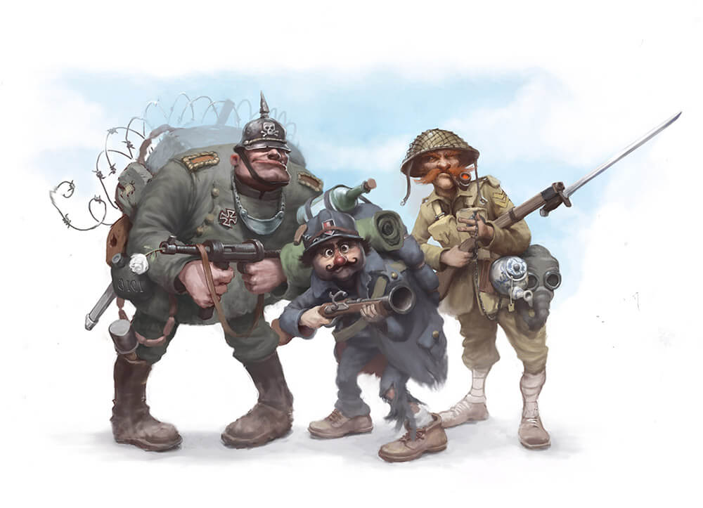

# Welcome to Tor Jäger Illustration,

#### This website is created for the freelance illustrator Tor Jäger. The previous website torjager.net/torjager.se really needed some updates and a new fresh apporoach. Tor Jäger is based in Stockholm, Sweden, but clients could come from over the world so the site should be easy to read and inspiering. The goal of this site is to attract and connect with possible customers for illustration jobs, inspire people to read the books but also just inspire peolple scrolling through the site.

------
## Responsive

#### 

------

## Features

####
-------
## Testing

#### I tested that the site worked in different browsers: Google Chrome, Firefox

#### I confirmed that this project is responsive, looks good and functions on all standard screen sizes using the devtools device toolbar.

#### I confirmed that the navigaton, header, about, gallery and contact are all readable and easy to understand.

#### I confirmed that the form works requires entries in every field, will only accept one email in the email field and the submit buttom works.

-------

## Bugs

------

## Validator testing

### HTML:
#### No errors were returned when passed through the official W3C validator.

### CSS:

### Accessability:
#### I confirmed that the colors and fonts chosen are easy to read and accesible through lighthouse in devtools.

-----

## Unfixed bugs

#### No unfixed bugs.
-----

## Deployment

#### This site was deployed to Github pages. The steps to deploy are as follows:
* In the Github respiratories, navigate to the settings tab. 
* From the source section drop-down menu, select the Master branch.
* Once the master branch has been selected, the page provided the link to the completed website. 
The link can be found here:

-----

## Credits

#### A lot of content is reused from torjager.se, for instance som pictures and the about-text. Furhter material/pictures has been provided from the illustrator himself who has also given his appproval of using the material for this project. Some of the pictures are also published in his books.
#### Inspiration has also come from the Code Institute projects Coders coffeehouse (https://learn.codeinstitute.net/sandbox/api/challenges/60338cca9c4983ac5d855130/files/index.html#home) and Love Running

----

## Content

#### The pictures on the site and in the gallery has been chosen in order to provide a variety of styles.

----

## Media

-----
